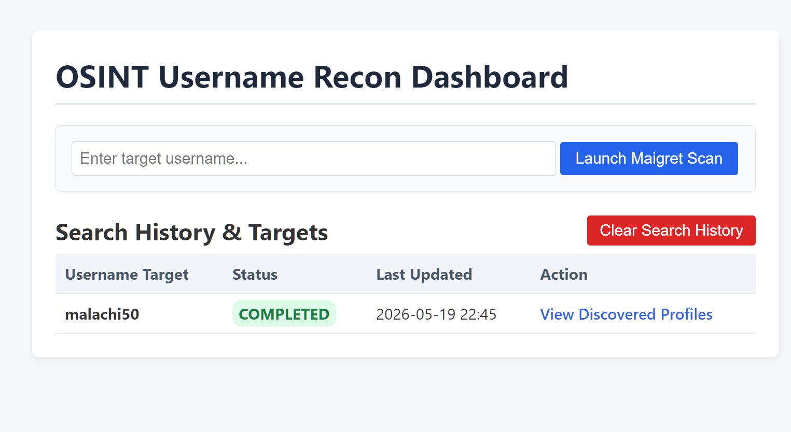
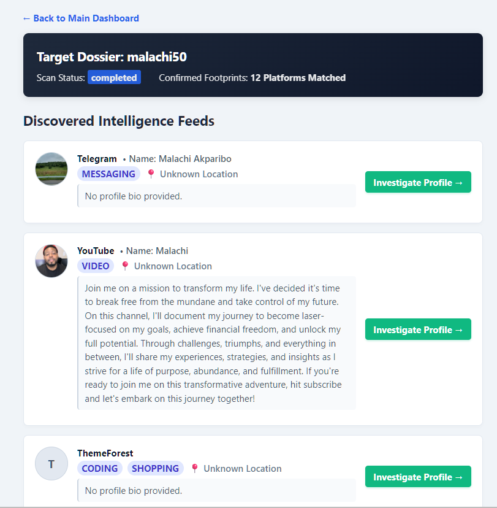
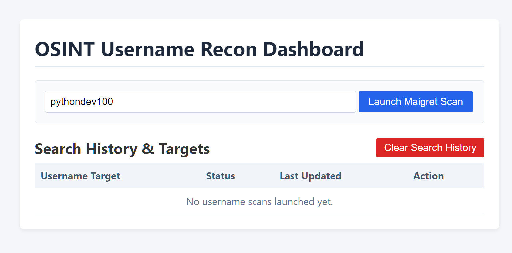
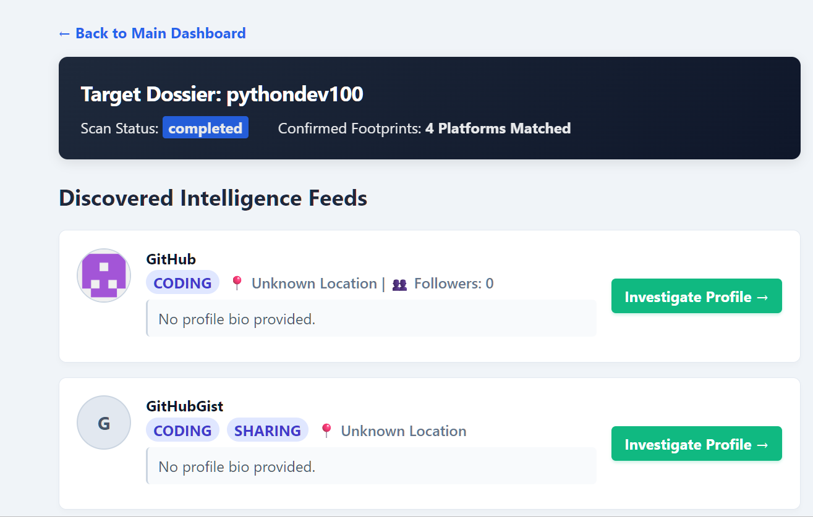

# 🕵🏽 OSINT Username Intelligence Dashboard


A powerful, full-stack Open Source Intelligence (OSINT) workstation that automates username footprinting across the web. The platform utilizes an asynchronous decoupled architecture to execute background investigations, stream network telemetry, and compile raw data into a clean, human-readable visual intelligence dossier.

---

<details>
  <summary>📸 Screenshots</summary>






</details>

---

## 🚀 Key Features
- **Decoupled Architecture:** Utilizes a Django web user interface backed by a high-performance, asynchronous FastAPI scanning engine.
- **Automated Target Scouting:** Leverages `Maigret` via robust CLI execution pipelines to scan across 100+ top platforms simultaneously.
- **Windows-Hardened Pipelines:** Built-in environment encoding overrides to completely prevent terminal-pipe string glitches (`UnicodeDecodeError`).
- **Disk-Reader File Syncing:** Bypasses buggy network webhooks on local machines by dynamically mapping and analyzing raw JSON report footprints right off the disk.
- **Beautiful Intelligence Dossiers:** Automatically extracts profile imagery, user bios, tags, location vectors, and platform metrics from raw nested data streams.

---

## 📂 Project Structure
```python
osint_dashboard/
│
├── api/                       # FASTAPI ASYNC SCANNING ENGINE
│   ├── main.py                # Core background worker & Pydantic request models
│   └── requirements.txt       # Engine specific dependencies (fastapi, pydantic, uvicorn)
│
├── core/                      # DJANGO WEB APPLICATION ROOT
│   ├── manage.py              # Django management CLI wrapper
│   ├── core/                  # Main settings and project routing configuration
│   │   ├── settings.py
│   │   └── urls.py
│   │
│   └── scanner/               # WEB DASHBOARD APPLICATION INTERFACE
│       ├── models.py          # Database schema (TargetSearch tracking, DiscoveredProfile)
│       ├── views.py           # Human-readable JSON engine logic & web handlers
│       ├── urls.py            # App routing paths
│       └── templates/
│           └── scanner/
│               ├── dashboard.html # Search entry center & historic hunt listing
│               └── results.html   # Modern cleaned OSINT visual dossier
│
└── reports/                   # Disk storage directory for raw Maigret output
└── screenshots                # Images of the dashboard
└── tests/                     # Pytest/Hypothesis suite
|   ├── test_api_worker.py
│   ├── test_models.py
|   ├── test_views_logic.py
```

---

# 🛠️ Installation & Setup
Prerequisites
Python 3.11+ installed (Verified stable on Python 3.13)

Windows OS (PowerShell / Command Prompt access)

### Global Tools Installation
Ensure maigret is installed and registered globally on your computer terminal:

```Bash
pip install maigret
```
### Configure the FastAPI Async Worker
Open a fresh terminal window, navigate to your API folder, and spin up the engine:

```Bash
cd C:\Users\Admin\Desktop\code\osint_dashboard\api
pip install -r requirements.txt
uvicorn api.main:app --host 127.0.0.1 --port 8001 --reload
```
- The background scanner is now operational on port 8001.

### Configure the Django Web UI Front-End
Open a second terminal window, navigate to your core project directory, prepare your database migrations, and activate the server:

```Bash
cd C:\Users\Admin\Desktop\code\osint_dashboard\core
pip install -r requirements.txt
python manage.py makemigrations
python manage.py migrate
python manage.py runserver 127.0.0.1:8000
```
- The web front-end interface is now operational on port 8000.

---

## 🎯 How To Run An Investigation
- Fire up your web browser and open http://127.0.0.1:8000/.

- Input a target username (e.g., reory35) into the dashboard form search bar and click Initiate Scout Search.

- The dashboard UI logs the status as pending and immediately pushes the workload to the FastAPI worker via a background thread.

- Once the scan is marked complete, click View Intelligence Feeds to pull the disk-parsed visual dossier straight into view.

---

<details>
  <summary>🛣️ Future Roadmap</summary>

- [ ] Email & Domain OSINT: Integrate tools like theHarvester or holehe directly into the worker subprocess arrays.

- [ ] Biometric Pfp Matching: Add automated image similarity scanning across confirmed profile avatar images using Pillow and DeepFace.

- [ ] Interactive Graphs: Implement interactive relationship network webs using vis.js or cytoscape.js.

- [ ] Dossier Exports: One-click automated PDF intelligence report generation using WeasyPrint.
</details>

---

* **Built by Roy Peters** 😁
[](https://www.linkedin.com/in/roy-p-74980b382/)